# bevy_picoui
A little immediate mode ui for bevy with no other dependencies. 

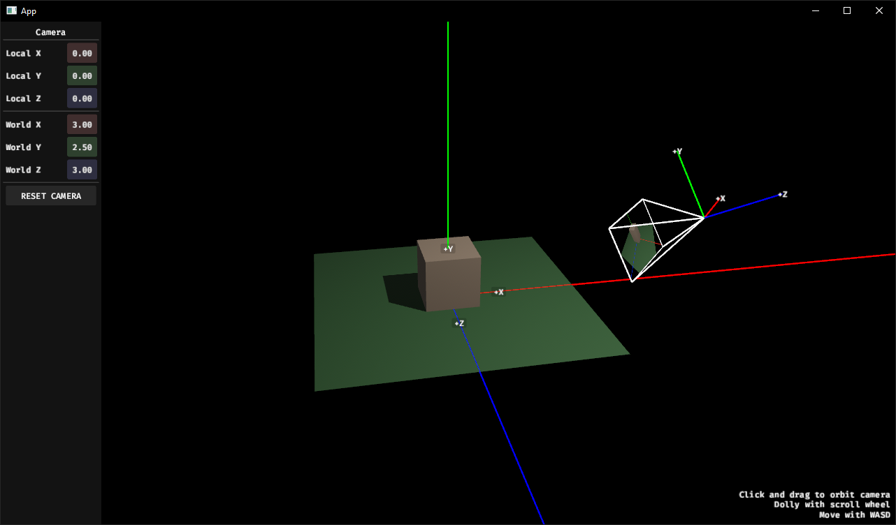 
[coordinate_systems example](examples/coordinate_systems.rs)

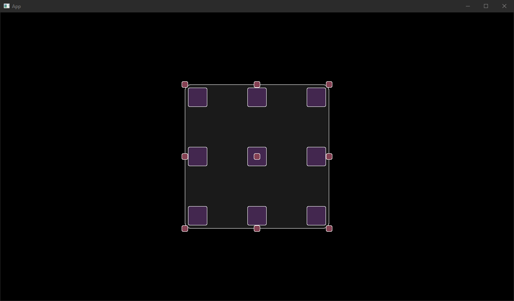 
[anchors example](examples/anchors.rs)

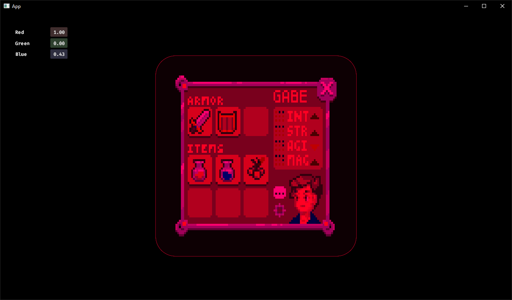 
[blend_modes example](examples/blend_modes.rs)

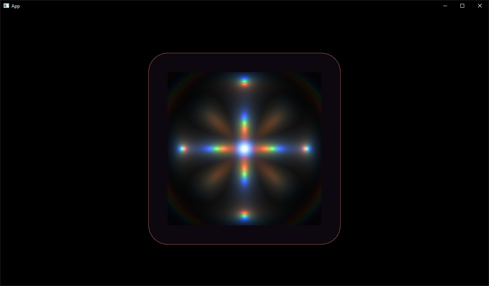 
[custom_material example](examples/custom_material.rs)

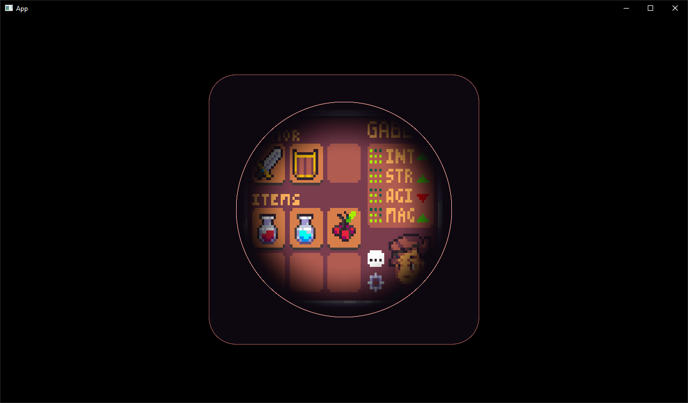 
[image example](examples/image.rs)

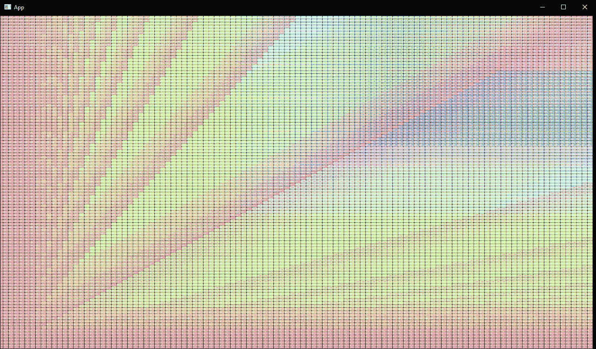 
[many_buttons example](examples/many_buttons.rs)

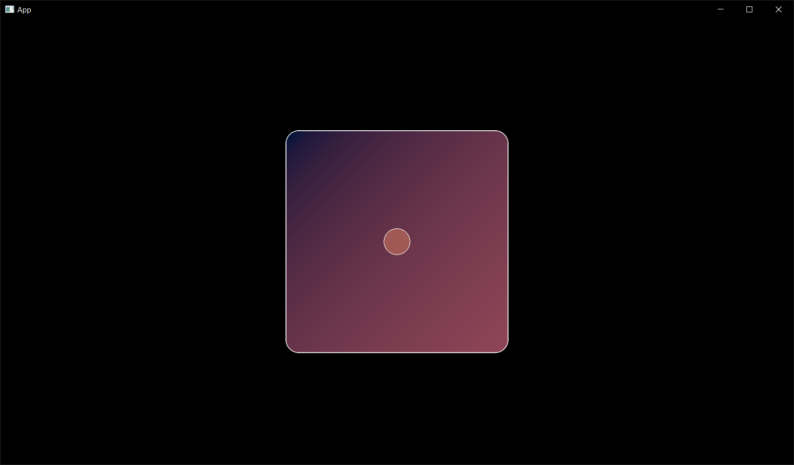 
[movable example](examples/movable.rs)

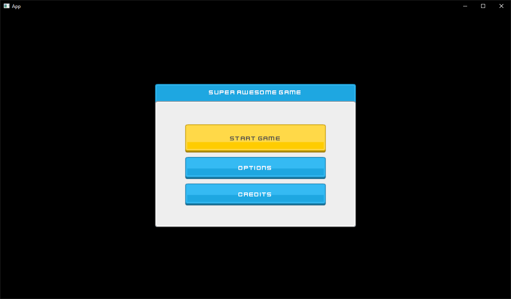 
[nine_patch example](examples/nine_patch.rs)

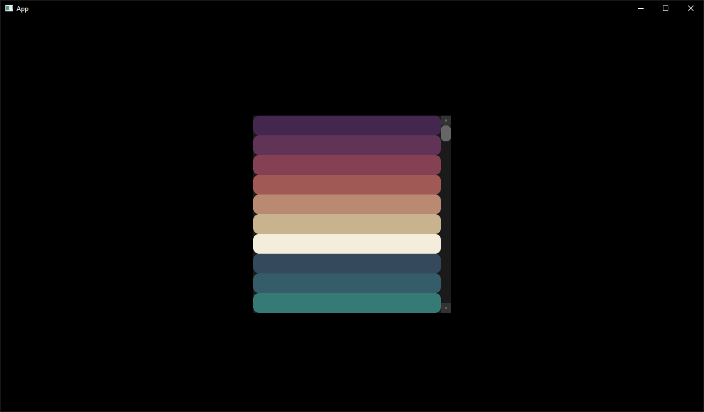 
[scroll example](examples/scroll.rs)

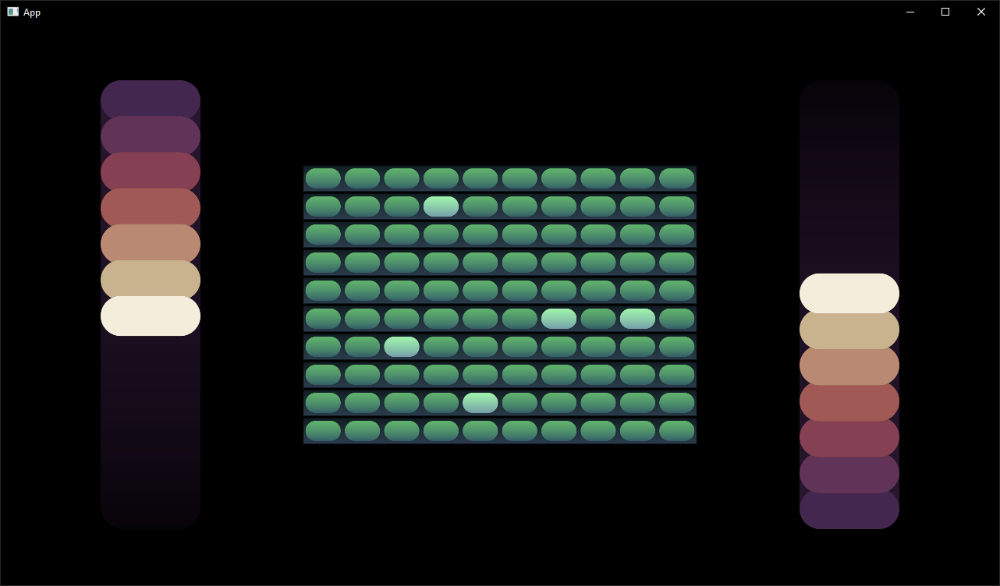 
[stacks example](examples/stacks.rs)

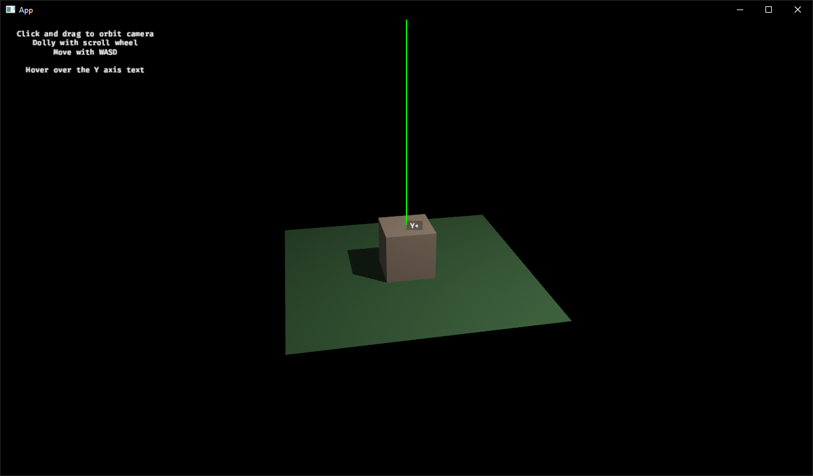 
[text_3d_position example](examples/text_3d_position.rs)

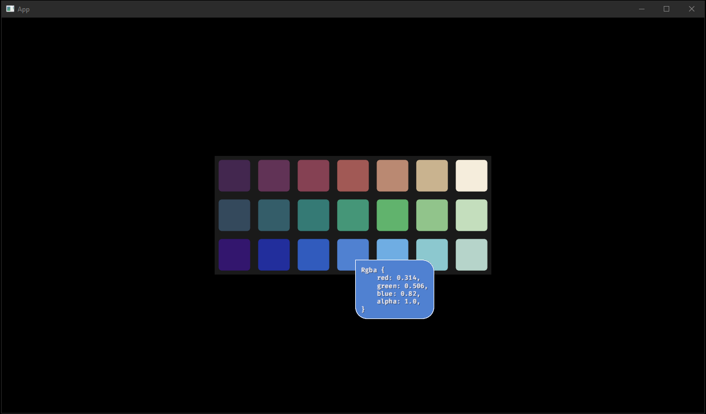 
[tooltip example](examples/tooltip.rs)

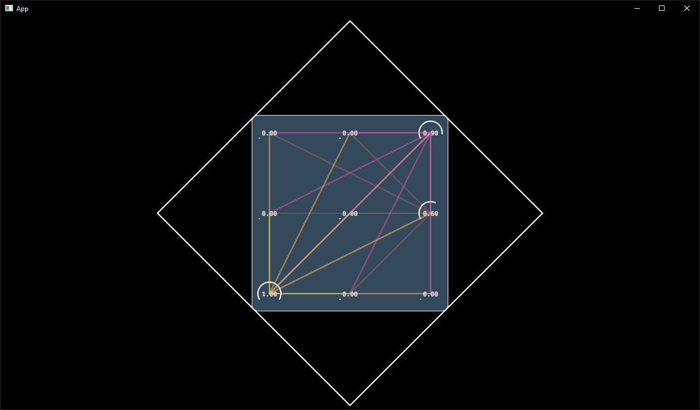 
[vector_shapes example](examples/vector_shapes.rs)
